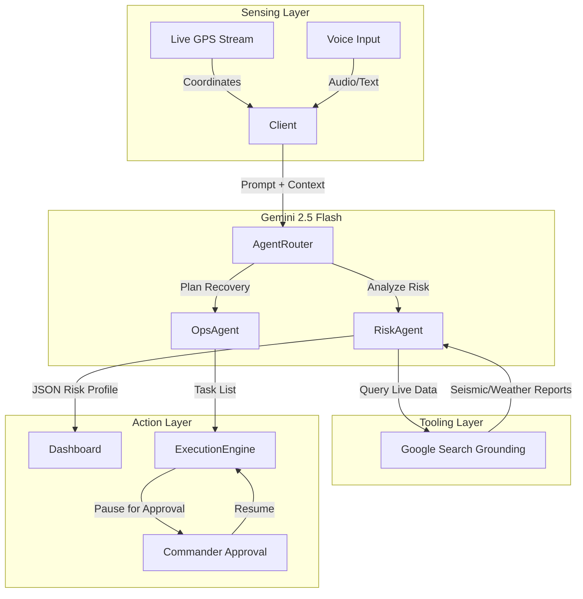

# 🛡️ AI-Disaster-Guardian

> **🏆 Kaggle AI Agents Competition Submission**  
> **Track:** Agents for Good  
> **Tagline:** An autonomous command center for real-time disaster prediction, global monitoring, and agentic recovery operations.

[](https://luxury-dieffenbachia-ca34f4.netlify.app/)


---

## 📖 The Pitch

### The Problem
Natural disasters are becoming more frequent and severe. In the critical first hours:
1.  **Information Overload:** Civilians struggle to find verified local emergency contacts and understand their specific risk level in real-time.
2.  **Static Warnings:** Traditional weather alerts are broad and don't account for a user's specific, real-time movement into danger zones.
3.  **Coordination Lag:** Creating actionable recovery plans takes valuable time that first responders often don't have.

### The Solution
**AI-Disaster-Guardian** is a multi-agent system that acts as a personal protector for civilians and a tactical officer for responders. It unifies three core capabilities:
*   **Hyper-Local Early Warning:** Uses live GPS telematics and Gemini with Search Grounding to calculate a real-time "Risk Score" (0-100).
*   **Global Situational Awareness:** A visual intelligence dashboard tracking active disasters globally via satellite data.
*   **Agentic Recovery Operations:** An autonomous agent that generates and executes recovery plans with human-in-the-loop oversight.

---

## 🏗️ System Architecture

The system is built on a **Sense-Think-Act** loop powered by Google Gemini 2.5.
This project explicitly demonstrates **three (3)** key course concepts:

### 1. Built-in Tools (Google Search Grounding)
Instead of relying on stale training data, the **Risk Analysis Agent** uses the `googleSearch` tool to fetch live seismic reports and weather warnings.

*   **Implementation:** `services/geminiService.ts`
*   **Behavior:** The agent queries the web for "current floods in [Lat, Lng]" before calculating the risk score.

### 2. Long-Running Operations (Pause/Resume)
The **Recovery Operations Agent** implements a state machine to manage long-running tasks. It supports a "Human-in-the-Loop" workflow where critical tasks require commander approval.

*   **Implementation:** `views/RecoveryOps.tsx`
*   **States:** `IDLE` → `PLANNING` → `EXECUTING` → `AWAITING_APPROVAL` → `COMPLETED`.
*   **Behavior:** The execution loop pauses automatically when a task finishes, waiting for the user to verify the action before resuming.

### 3. Observability (Live Logging)
To ensure trust, the system exposes its internal reasoning via a real-time terminal.

*   **Implementation:** `views/RecoveryOps.tsx`
*   **Behavior:** Users can see exactly what the Agent is thinking (e.g., `[AI] Analyzing intent...`, `[COMMS] Voice command received`).
  

---

## ✨ Key Features

### 📍 1. Early Detection & Warning System (Local)
*   **Live GPS Tracking:** Uses `watchPosition` to track user movement in real-time.
*   **Dynamic Risk Engine:** Re-analyzes threat levels every 30 seconds based on changing terrain and weather.
*   **Native Alert Bridge:** Generates deep links (`sms:`, `mailto:`) to instantly broadcast AI-written warnings to family members.
*   **Local Emergency Contacts:** Automatically finds the nearest Police, Fire, and Ambulance stations based on coordinates.

### 🌍 2. Global Disaster Monitor
*   **Satellite Live Stream:** A daylight-mode interactive map visualizing active disasters globally.
*   **Auto-Polling:** Updates incident data automatically without manual refresh.
*   **User Telemetry:** Visualizes the user's live position relative to active danger zones.

### ⛑️ 3. Recovery Operations Agent
*   **Voice Command Mode:** Commanders can speak natural language orders (e.g., *"Cancel the drone flight and send a medical team"*). The AI interprets the intent and modifies the operational plan in real-time.
*   **Sequential Execution:** The agent executes tasks one by one, updating status from 'Pending' to 'In Progress' to 'Completed'.

---

## 🚀 Getting Started

### Prerequisites
*   Node.js (v16+)
*   Google AI Studio API Key (Gemini)

### Installation

1.  **Clone the repository**
    ```bash
    git clone https://github.com/yourusername/ai-disaster-guardian.git
    cd ai-disaster-guardian
    ```

2.  **Install dependencies**
    ```bash
    npm install
    ```

3.  **Configure API Key**
    Create a `.env` file in the root directory:
    ```env
    API_KEY=your_google_gemini_api_key_here
    ```
    *Note: Ensure your API key has access to `gemini-2.5-flash` and `googleSearch` tool.*

4.  **Run the application**
    ```bash
    npm start
    ```
    Open `http://localhost:3000` in your browser.

---

## 🎮 Usage Guide

1.  **Simulate a Threat:**
    *   Go to **Local Warning**.
    *   Click **"Activate Early Warning System"**.
    *   Allow location permissions. The AI will analyze your surroundings.

2.  **Global Monitoring:**
    *   Switch to **Global Map**.
    *   Zoom in/out to see where disasters are happening relative to you.

3.  **Agent Command:**
    *   Go to **Recovery Ops**.
    *   Select a scenario (e.g., "Flood").
    *   Click **"Generate Plan"**.
    *   **Voice Test:** Click the **Microphone** button and say: *"Add a task to distribute water bottles."*
    *   Watch the AI update the list instantly.

---

## 🛠️ Tech Stack

*   **Agentic Core:** Google Gemini 2.5 Flash
*   **Frontend:** React 19, TypeScript
*   **Styling:** Tailwind CSS
*   **Visualization:** Recharts, Lucide Icons
*   **Geolocation:** Native Browser API

---

## 📄 License

This project is licensed under the MIT License.

---

*Built with ❤️ for the Kaggle AI Agents Competition.*
